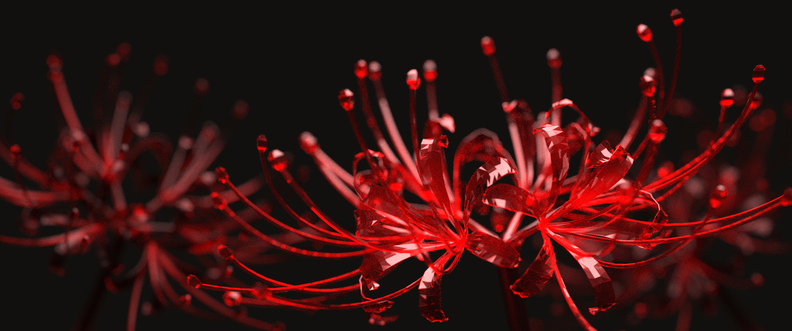
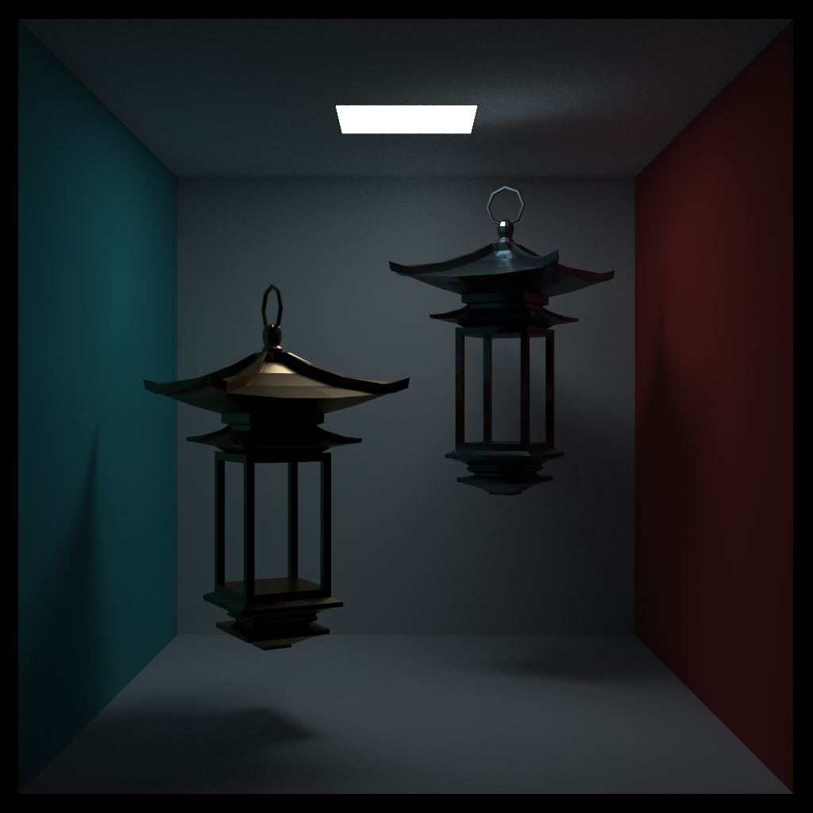
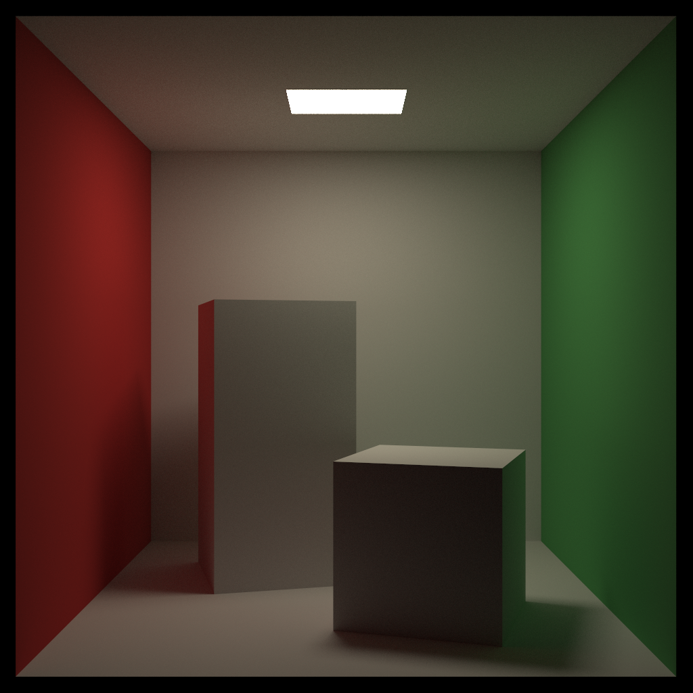
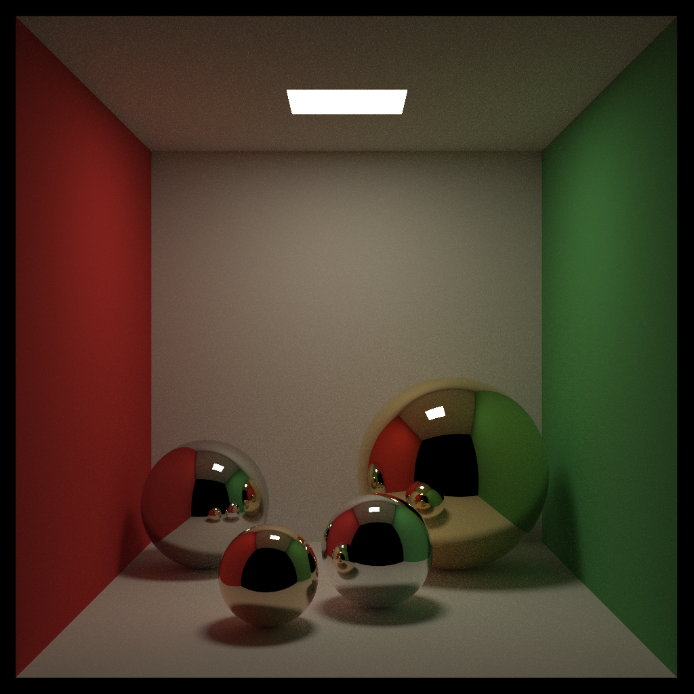
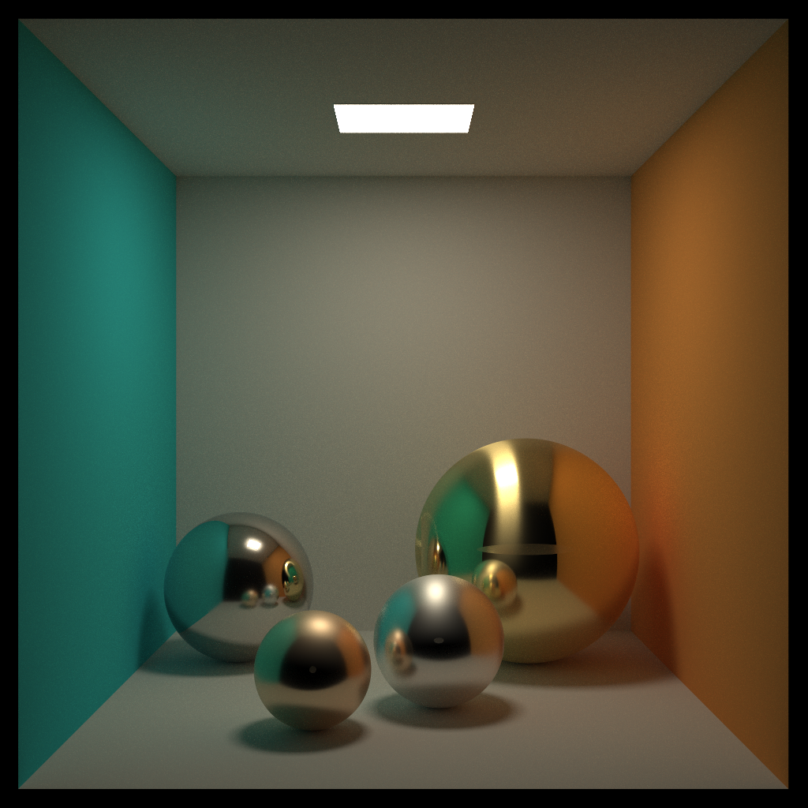
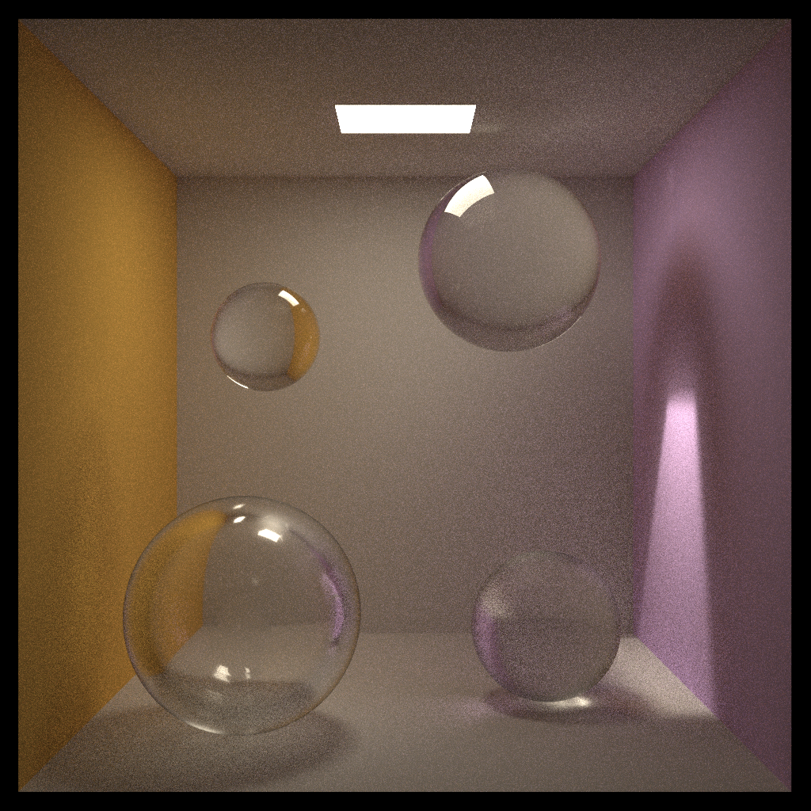
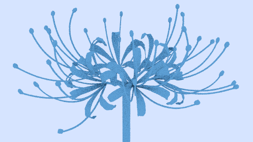
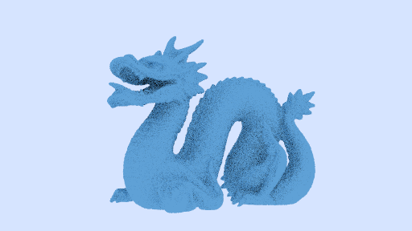

# CPU Pathtracer

This is a CPU pathtracer that uses Monte Carlo pathtracing to create a photorealistic image of a scene given geometry and materials.

## Features

- Lambertian, dielectric, conductor, and emissive materials
  - Trowbridge-Reitz/GGX microfacet distribution for rough dielectrics and conductors
- Bounding Volume Hierarchy (BVH) acceleration structure
- Multiple Importance Sampling (MIS) between BSDF sampling and Next Event Estimation (NEE)
- .obj model loader
- Russian roulette path termination

## Overview

I made this pathtracer for educational purposes as my first graphics programming project, from November 2025 to January 2026. I'm interested in graphics programming because it's where computer science intersects with art, math, and physics, all of which I find very cool and enjoyable. Plus, there's applications in video games and animation, which is where I want to be in the future. This project has taught me a lot about the basics of realistic rendering, given me ideas for directions to explore further, and has just been a lot of fun!

## Renders

First, here are some creative renders I made.

<figure>
    
    <figcaption> Red dielectric spider lilies with depth of field. The foreground one is actually using a diamond material with IOR 2.42 while the other two are normal glass with IOR 1.5. The spider lily model was made by me and loaded in using my .obj loading feature. Rendered at 1920x803, 1024 spp, 16 max bounces. </figcaption>
</figure>

<figure>
    
    <figcaption> A spooky take on the Cornell box with some Chinese lamp models I made. Both lamps' materials use the Trowbridge-Reitz/GGX microfacet distribution to get the rough conductor look. Rendered at 1024x1024, 1024 spp, 16 max bounces. </figcaption>
</figure>

Here are some more standard renders and material/feature tests.

<figure>
    
    <figcaption>A standard Cornell box. Rendered at 1024x1024, 512 spp, 16 max bounces. </figcaption>
</figure>

<figure>
    
    <figcaption> Perfect mirror metal spheres. From left to right: using physically accurate wavelength dependent (split for RGB) IOR for steel, copper, silver, gold. Rendered at 1024x1024, 1024 spp, 16 max bounces. </figcaption>
</figure>

<figure>
    
    <figcaption> Metal spheres of varying roughness and anisotropy. Roughness is using the Trowbridge-Reitz/GGX microfacet distribution. Rendered at 1024x1024, 1024 spp, 16 max bounces. </figcaption>
</figure>

<figure>
    
    <figcaption> Glass spheres of varying roughness, one of which is hollow. Despite the high sample count it's still noticeably noisy because unidirectional pathtracing doesn't do too well with specular reflection and transmission. Rendered at 1024x1024, 1024 spp, 16 max bounces. </figcaption>
</figure>

<figure>
    
    <figcaption> Spider lily model from before, containing 23992 triangles. With BVH, it took 3.4 seconds to render, without it was so slow that I did not wait for it to finish. Rendered at 512x288, 8 spp, 3 max bounces. </figcaption>
</figure>

<figure>
    
    <figcaption> The Stanford Dragon containing 871414 triangles. Rendered at 512x288, 8 spp, 3 max bounces. </figcaption>
</figure>

## Process and Resources Used

Like many others, I started with the [Raytracing in One Weekend series](https://raytracing.github.io). After completing the first volume and a couple features from the second volume, I turned to [PBRT](https://www.pbrt.org) to refactor my code to use Kajiya's rendering equation and add advanced features like MIS and microfacets. Supplementary (but very helpful) resources include various blog posts and articles, YouTube videos, and LLMs. 

## How to Use

Define the scene in ```main.cpp``` by creating primitives or loading a model, creating materials, creating lights, setting camera settings, and adding them to the world. From the root folder (containing ```main.cpp```) run:

```bash
cmake --build build
build/raytracing > image.ppm
```

The output image will be written to ```image.ppm``` (it will override any previous data that was there so be careful).

This project is also multithreaded thanks to the OpenMP library so you will need to install that and possibly modify ```CMakeLists.txt``` to add it correctly.

## License

[MIT](https://choosealicense.com/licenses/mit/)

